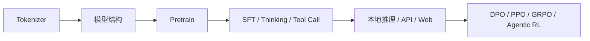

# MiniMind 新手 7 天上手路线

这份路线图面向“有 Python 基础，但刚接触大语言模型”的读者。目标不是一次性讲完所有技术细节，而是先带你跑通最小闭环，再逐步建立对源码的整体理解。

如果你是第一次打开这个仓库，建议先按这里的顺序走，再去读更细的单课讲义。

## 你这一周要达成什么

到第 7 天结束时，你应该能做到下面几件事：

- 独立跑通 1 次最小训练闭环：Tokenizer、Pretrain、SFT、`eval_llm.py`
- 能解释 MiniMind 的前向主链路：`Config -> Embedding -> Attention -> FFN -> LM Head -> generate`
- 能看懂本仓库的主数据格式，知道 `jsonl`、`conversations`、`<tool_call>`、`<tool_response>`、`<think>` 各自服务什么阶段
- 能说清 `train_pretrain.py`、`train_full_sft.py`、`eval_llm.py`、`serve_openai_api.py` 分别在做什么

## 先记住这张学习地图



可以把它理解成一句话：

- Tokenizer 决定模型怎么“看见文本”
- 模型结构决定文本怎么在网络里流动
- Pretrain 让模型学会语言统计规律
- SFT 让模型学会对话模板、角色、工具调用和思考格式
- 推理与服务化让训练好的模型真的能用起来
- RL 是后续增强阶段，不适合新手一开始就深挖

## 开始前的准备

推荐环境假设：

- 单卡 GPU
- 先使用仓库里的 mini 数据
- 第一周以“跑通并读懂主线”为目标，不追求完整复现所有训练结果

最小安装命令：

```bash
pip install -r requirements.txt
```

## 每天该做什么

### 第 1 天：先建立全局图景

目标：

- 知道这个项目有哪些阶段
- 知道这些阶段的先后关系

先看这些文件和图片：

- `README.md`
- `images/dataset.jpg`
- `images/LLM-structure.jpg`

当天输出：

- 画出自己的 1 页流程图：`Tokenizer -> Pretrain -> SFT -> eval/service -> RL`
- 给每个阶段写一句不超过 20 个字的定义

### 第 2 天：读 Tokenizer 与数据格式

从这里开始：

- `docs/01-train_tokenizer-guide.md`
- `notebook/train_tokenizer.ipynb`
- `trainer/train_tokenizer.py`
- `dataset/sft_t2t_mini.jsonl`

建议命令：

```bash
cd trainer
python train_tokenizer.py
```

当天重点：

- 为什么 tokenizer 不是“可有可无的预处理”
- `conversations` 是如何被整理成训练文本的
- `<tool_call>`、`<tool_response>`、`<think>` 为什么要在 tokenizer 阶段就考虑

### 第 3 天：读模型主文件，只看 Dense 主线

从这里开始：

- `docs/02-read_model_guide.md`
- `model/model_minimind.py`

当天重点：

- `MiniMindConfig`
- `RMSNorm`
- `Attention`
- `FeedForward`
- `MiniMindBlock`
- `MiniMindModel`
- `MiniMindForCausalLM`

第一次阅读不要深挖这些点：

- RoPE 细节
- KV Cache
- MoE
- flash attention

### 第 4 天：跑通 Pretrain，并理解训练循环

从这里开始：

- `docs/03-pretrain-guide.md`
- `trainer/train_pretrain.py`
- `dataset/lm_dataset.py`
- `trainer/trainer_utils.py`

建议命令：

```bash
cd trainer
python train_pretrain.py
```

当天重点：

- 参数解析
- `PretrainDataset`
- `DataLoader`
- `model(input_ids, labels=labels)`
- `loss.backward() / optimizer.step()`
- checkpoint 保存

### 第 5 天：跑通 SFT，并理解 Thinking / Tool Call

从这里开始：

- `docs/04-sft-thinking-tool-guide.md`
- `trainer/train_full_sft.py`
- `dataset/lm_dataset.py`
- `eval_llm.py`

建议命令：

```bash
cd trainer
python train_full_sft.py
cd ..
python eval_llm.py --weight full_sft
python eval_llm.py --weight full_sft --open_thinking 1
```

当天重点：

- `SFTDataset` 如何构造训练样本
- `generate_labels()` 为什么只在 assistant 回答区间计算 loss
- `open_thinking=0/1` 如何通过模板影响推理输入

### 第 6 天：看推理与服务化接口

从这里开始：

- `docs/05-inference-service-guide.md`
- `eval_llm.py`
- `scripts/serve_openai_api.py`
- `scripts/web_demo.py`

建议命令：

```bash
cd scripts
python serve_openai_api.py
```

如果本地已经有 transformers 格式权重，可以继续：

```bash
cd scripts
streamlit run web_demo.py
```

当天重点：

- 本地推理脚本和服务脚本的关系
- `reasoning_content`、`tool_calls`、`open_thinking` 在服务层如何解析和透传
- 为什么“源码不只是训练，也服务实际交互”

### 第 7 天：把 RL 当成进阶阅读地图

从这里开始：

- `docs/06-rl-reading-map.md`
- `trainer/train_dpo.py`
- `trainer/train_ppo.py`
- `trainer/train_grpo.py`
- `trainer/train_agent.py`

当天目标：

- 建立地图，不追求公式推导
- 知道每个脚本比 SFT 多了什么反馈信号

当天输出：

- 做一张对比表：`SFT / DPO / PPO / GRPO / Agentic RL`
- 每种方法用一句话说明“训练信号来自哪里”

## 推荐阅读顺序

如果你只想记一条最稳的主线，就按下面的顺序打开文件：

1. `README.md`
2. `docs/01-train_tokenizer-guide.md`
3. `trainer/train_tokenizer.py`
4. `model/model_minimind.py`
5. `dataset/lm_dataset.py`
6. `trainer/train_pretrain.py`
7. `trainer/train_full_sft.py`
8. `eval_llm.py`
9. `scripts/serve_openai_api.py`
10. `trainer/train_grpo.py`

## 学习时的默认策略

每一课都尽量遵循这个顺序：

1. 先看现象：先知道它解决什么问题
2. 再看命令：先把最小实验跑起来
3. 最后读源码：把“现象”和“代码”对上

遇到新文件时，优先找下面 5 个点：

- 参数
- 数据
- forward
- loss
- 保存或生成

## 配套讲义入口

这套路线配套的讲义按这个顺序读：

- `docs/01-train_tokenizer-guide.md`
- `docs/02-read_model_guide.md`
- `docs/03-pretrain-guide.md`
- `docs/04-sft-thinking-tool-guide.md`
- `docs/05-inference-service-guide.md`
- `docs/06-rl-reading-map.md`
- `docs/07-self-checklist.md`

## 如果你卡住了

先不要着急继续往后读，优先检查自己是否已经能回答下面三个问题：

1. 我现在读的这个文件，输入是什么，输出是什么？
2. 这个阶段的训练信号是什么？
3. 这个文件和前一个阶段是什么关系？

如果这三个问题有两个还答不上来，说明更适合回到上一课，而不是继续加新材料。
