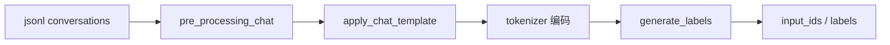
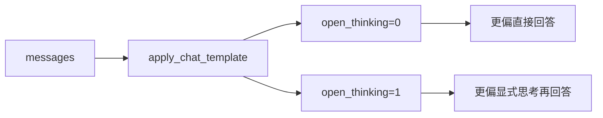

# 第 5 课：读 SFT、Thinking 与 Tool Call

这节课是 MiniMind 主线里最重要的一课之一。

如果说 Pretrain 主要是在学“语言规律”，那 SFT 学的就是“怎么按助手身份和协议去回答”。多轮对话、角色模板、工具调用、显式思考输出，都会在这一阶段被灌进模型。

## 这节课的目标

- 跑通 `trainer/train_full_sft.py`
- 看懂 `SFTDataset` 如何把多轮对话变成训练样本
- 看懂为什么只在 assistant 回答区域计算 loss
- 看懂 `open_thinking=0/1` 如何通过模板改变推理输入
- 理解 Tool Call 本质上仍然是语言建模问题

## 先跑最小命令

```bash
cd trainer
python train_full_sft.py
cd ..
python eval_llm.py --weight full_sft
python eval_llm.py --weight full_sft --open_thinking 1
```

如果显存不足，可以先降一下配置：

```bash
cd trainer
python train_full_sft.py --batch_size 2 --max_seq_len 512
```

## 这节课先看哪些文件

- `trainer/train_full_sft.py`
- `dataset/lm_dataset.py`
- `eval_llm.py`
- `trainer/train_tokenizer.py`
- `README.md` 里 `open_thinking` 的说明

## 先把 SFT 和 Pretrain 的差别记成一句话

- Pretrain 主要学“文本分布”
- SFT 主要学“按指定角色和格式完成任务”

两者都可能用交叉熵，但数据和目标完全不一样。

## 先从 `SFTDataset` 看起

这部分在 `dataset/lm_dataset.py` 里。

推荐顺序：

1. `pre_processing_chat()`
2. `create_chat_prompt()`
3. `generate_labels()`
4. `__getitem__()`

### 1. `pre_processing_chat()`

这个函数会在部分样本前面随机补一个 system 提示。

你第一次看到这段逻辑时，要抓住它的教学意义：

- SFT 不只是喂内容
- 它还会塑造对话结构和助手身份

同时代码里还特地保留了 tool use 样本的完整结构，这说明：

- 工具调用样本已经被视为主线数据的一部分

### 2. `create_chat_prompt()`

这是 SFT 数据到模型输入之间最关键的一层。

它会做两件事：

1. 把 `tools`、`tool_calls` 这些字段还原成真正的结构
2. 调用 tokenizer 的 `apply_chat_template(...)`

这说明一件很重要的事：

- 多轮对话不是直接原样送进模型
- 它会先被统一格式化成一段符合 MiniMind 协议的文本

你要重点记住：

- chat template 是“多轮消息结构”和“实际训练文本”之间的桥

### 3. `generate_labels()`

这是这节课最值得慢慢看的函数。

它的核心逻辑是：

- 先遍历整个 prompt
- 找到 assistant 回答的起点和终点
- 只把 assistant 回答区间写入 labels
- 其他位置都保持 `-100`

这一步为什么重要？

因为它决定了：

- system 提示不直接参与监督
- user 问题不直接参与监督
- 模型真正被要求学习的是“assistant 应该怎么接着写”

你可以把它理解成：

- SFT 不是让模型背诵整段对话
- 而是让模型学会“在当前对话上下文下，assistant 应该怎么回答”

### 4. `__getitem__()`

这里把前面所有步骤串了起来：

1. 取出一条 `conversations`
2. 做预处理
3. 通过 chat template 得到 prompt
4. 对 prompt 编码成 token ids
5. padding 到固定长度
6. 调用 `generate_labels()`

这就是完整的 SFT 样本构造流程。

## 为什么 `<think>` 不是“魔法开关”

很多新手第一次接触 thinking 模式时，容易把它理解成“模型内部忽然多了一套思维引擎”。在这个仓库里，更准确的理解是：

- thinking 首先是一种模板和数据协议
- 其次才是模型在这个协议上学到的行为习惯

你可以从三个地方把这件事串起来看：

1. `trainer/train_tokenizer.py` 里，`<think>` 被加入特殊协议体系
2. SFT 数据和 chat template 会把 `<think>` 结构写进训练文本
3. `eval_llm.py` 与服务脚本通过 `open_thinking` 决定推理提示中是否预留 `<think>` 起始结构

所以正确理解是：

- `open_thinking=0/1` 改变的是模板注入方式
- 模型是否会产出思考过程，取决于训练中见过的数据与协议

## 对照 `eval_llm.py` 看推理输入怎么变化

在 `eval_llm.py` 里，SFT 权重推理时会走：

```python
tokenizer.apply_chat_template(
    conversation,
    tokenize=False,
    add_generation_prompt=True,
    open_thinking=bool(args.open_thinking)
)
```

这里一定要读出两个重点：

- `add_generation_prompt=True` 说明模板会把 assistant 的回答起点补出来
- `open_thinking` 会决定 assistant 起始位置是否预先进入 `<think>` 模式

你可以把两种情况先粗略记成：

- `open_thinking=0`：模板里预留空的 `<think></think>`，模型更偏向直接回答
- `open_thinking=1`：模板里先注入 `<think>` 起始标签，模型更容易继续输出显式思考过程

## 为什么 Tool Call 本质上仍然是文本生成

这是很多人第一次学 agent 或工具调用时最容易误解的点。

在 MiniMind 这条主线上，Tool Call 的本质不是“模型在执行函数”，而是：

- 模型先生成一段符合协议的文本
- 这段文本恰好是 `<tool_call> ... </tool_call>` 包裹的 JSON
- 外部系统再去解析这段文本并调用真实工具

也就是说，模型层面学到的是：

- 什么时候该输出工具调用
- 工具调用文本该长什么样
- 工具返回后该如何继续接着回答

这仍然属于语言建模，只是输出文本的协议更结构化。

## 把 SFT 和 Pretrain 正式对比一次

### 相同点

- 都会把输入变成 token ids
- 都会进入 `MiniMindForCausalLM`
- 都会通过 logits 和 labels 算交叉熵

### 不同点

- Pretrain 数据更像普通文本
- SFT 数据是多轮对话与任务化样本
- Pretrain 主要让模型学语言分布
- SFT 主要让模型学角色、格式、任务完成方式
- SFT 会显式引入 `<think>`、`<tool_call>`、角色边界等协议

## 这一课最值得自己画出来的两张图

### 图 1：SFT 样本构造流程



### 图 2：thinking 开关影响推理模板



## 这节课读完后必须能回答的问题

1. `SFTDataset` 为什么不能直接像 Pretrain 一样只读 `text` 字段？
2. `generate_labels()` 为什么只让 assistant 区间参与 loss？
3. `apply_chat_template()` 在 SFT 中到底扮演什么角色？
4. 为什么 Tool Call 可以被理解成“特殊格式的文本生成”？
5. `open_thinking=0/1` 改变的到底是模型本身，还是推理模板？

## 你当天应该留下的学习产物

建议写一页自己的总结，至少包含下面三段：

### 1. 一句话解释 SFT

- SFT 是在更目标化的多轮对话和任务数据上，教模型按助手协议去回答

### 2. 一句话解释 Tool Call

- Tool Call 本质上是模型按约定协议生成结构化文本，再由外部系统解析执行

### 3. 一句话解释 `open_thinking`

- `open_thinking` 是模板层的推理控制开关，不是切换另一套模型
