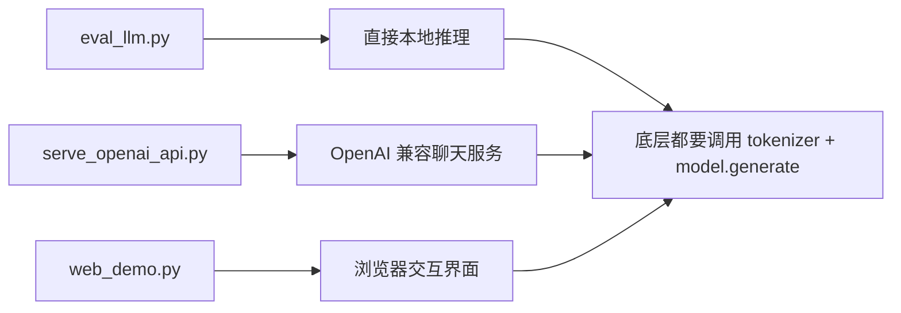

# 第 6 课：读推理与服务化接口

这节课的核心目标是把“训练好的模型怎么被真正使用”看明白。

前面几课你已经知道模型怎么定义、数据怎么进来、训练 loss 怎么算。现在要补上最后一段链路：

- 本地脚本怎么推理
- API 服务怎么接请求
- Web 演示怎么把交互包起来

## 这节课的目标

- 跑通至少一个推理入口
- 看懂 `eval_llm.py` 如何构造 prompt 并调用 `generate`
- 看懂 `scripts/serve_openai_api.py` 如何把请求转换成模型输入
- 看懂 `scripts/web_demo.py` 在整个系统里的位置

## 推荐顺序

1. 先读 `eval_llm.py`
2. 再读 `scripts/serve_openai_api.py`
3. 最后再读 `scripts/web_demo.py`

这样顺序最自然，因为：

- `eval_llm.py` 最接近“直接拿模型试一把”
- API 服务是在它上面再包一层请求协议
- Web Demo 又是在服务和模型之上加交互层

## 先跑最小命令

### 本地推理

```bash
python eval_llm.py --weight full_sft
python eval_llm.py --weight full_sft --open_thinking 1
```

### 启动 API 服务

```bash
cd scripts
python serve_openai_api.py
```

### 如果你已经有 transformers 格式权重

```bash
cd scripts
streamlit run web_demo.py
```

## 先记住三者关系



可以把它们理解成：

- `eval_llm.py` 是最直接的“命令行试模型”
- `serve_openai_api.py` 是最直接的“把模型变成接口”
- `web_demo.py` 是最直接的“把模型变成交互页面”

## 先读 `eval_llm.py`

这是最值得先读的推理入口。

第一次阅读时，重点看下面几件事：

### 1. `init_model(args)`

这里会做两件大事：

- 加载 tokenizer
- 加载模型权重

而且它支持两种来源：

- 原生 MiniMind 权重目录
- transformers 格式模型目录

你第一次不需要把所有分支都搞透，只要知道：

- 最终目标是得到 `model` 和 `tokenizer`

### 2. `conversation` 如何变成输入文本

当权重不是 pretrain 时，脚本会走：

```python
tokenizer.apply_chat_template(
    conversation,
    tokenize=False,
    add_generation_prompt=True,
    open_thinking=bool(args.open_thinking)
)
```

这说明：

- 推理时不是简单把 prompt 字符串直接喂给模型
- 而是先把多轮消息变成统一协议文本

这里和 SFT 那一课正好接上：

- 训练时模型见过这种模板
- 推理时也要继续按同一套模板组织输入

### 3. `model.generate(...)`

这里是本地推理的最终执行点。

它会接收：

- `input_ids`
- `attention_mask`
- `max_new_tokens`
- `top_p`
- `temperature`

然后生成后续 token。

你只要记住一句话：

- `eval_llm.py` 做的事，就是把“用户问题”变成“模型可生成的输入张量”

## 再读 `scripts/serve_openai_api.py`

这个脚本是连接“模型内部逻辑”和“外部应用”的关键。

推荐顺序：

1. 看 `ChatRequest`
2. 看 `parse_response()`
3. 看 `generate_stream_response()`
4. 看 `/v1/chat/completions`

### 1. `ChatRequest`

这里定义了接口层接收哪些字段。

重点看这些：

- `messages`
- `temperature`
- `top_p`
- `max_tokens`
- `stream`
- `tools`
- `open_thinking`
- `chat_template_kwargs`

这里要重点记住两件事：

- `messages` 是服务层的输入主载体
- `open_thinking` 可以直接传，也可以嵌在 `chat_template_kwargs` 里传

### 2. `parse_response()`

这段代码非常适合帮助新手理解“Thinking 和 Tool Call 在服务层是怎么被拆开的”。

它做了三件事：

1. 从返回文本中提取 `<think> ... </think>`，作为 `reasoning_content`
2. 从返回文本中提取 `<tool_call> ... </tool_call>`，作为 `tool_calls`
3. 剩下的普通回答文本，作为 `content`

这说明在服务层，模型输出仍然首先是一段文本。

服务层额外做的，只是：

- 把特殊协议文本拆成更结构化的字段

### 3. `generate_stream_response()`

这里是流式输出版本的核心逻辑。

你可以把它拆成下面几步：

1. 对 `messages` 套 chat template
2. tokenizer 编码成输入张量
3. 后台线程调用 `model.generate(...)`
4. 不断从 streamer 读取新文本
5. 如果处在 thinking 阶段，就把文本作为 `reasoning_content` 发出
6. 如果已经越过 `</think>`，就把后面的文本作为 `content` 发出
7. 最后如果解析到工具调用，再额外发出 `tool_calls`

这就是 `reasoning_content`、`content`、`tool_calls` 三者在流式服务里的分工。

### 4. `/v1/chat/completions`

这是 OpenAI 风格接口的入口。

这里分成两条路径：

- `stream=True`：走流式输出
- `stream=False`：一次性返回完整结果

但两条路径的核心都一样：

- 先把 `messages` 变成模型 prompt
- 再调用模型生成
- 最后把文本结果拆成结构化字段

## 最后再读 `scripts/web_demo.py`

这部分更适合把它看成“展示层”。

你第一次阅读时不需要陷进所有 UI 细节，重点看这几个问题：

1. 它如何维护会话历史
2. 它如何组织工具列表
3. 它如何触发模型推理
4. 它如何把 thinking 和工具调用展示出来

读这个文件时的心态建议是：

- 不把它当模型原理课
- 把它当“源码如何变成可交互产品”的示例

## 把三者正式连起来

### `eval_llm.py`

角色：

- 最直接的本地推理入口

最适合做什么：

- 快速验证模型能不能生成
- 对照命令行理解 chat template 和 `generate`

### `serve_openai_api.py`

角色：

- OpenAI 兼容接口层

最适合做什么：

- 把本地模型接到外部工具或第三方 Chat UI
- 理解结构化输出字段如何从文本中解析出来

### `web_demo.py`

角色：

- 浏览器交互展示层

最适合做什么：

- 直观观察多轮对话、thinking 和 tool use 的表现

## 这节课最重要的三个结论

### 1. 推理和训练用的是同一套模板协议

这很重要，因为它说明：

- 模型训练时学到的格式
- 正是推理时输入和输出继续使用的格式

### 2. `reasoning_content` 和 `tool_calls` 不是模型内部神秘对象

更准确地说：

- 模型先生成文本
- 服务层再从文本里解析出结构化字段

### 3. 服务化不是和源码分离的另一套系统

恰恰相反：

- 服务层只是把 tokenizer、模板、生成和输出解析重新包成接口

## 这节课读完后必须能回答的问题

1. `eval_llm.py` 和 `serve_openai_api.py` 最核心的共同点是什么？
2. 为什么 `messages` 不能直接原样送进模型，而要先走 `apply_chat_template()`？
3. `reasoning_content` 在服务层是怎么从文本里拆出来的？
4. `tool_calls` 在服务层是怎么从文本里拆出来的？
5. `web_demo.py` 为什么更适合被看成“交互包装层”而不是“模型原理文件”？

## 你当天应该留下的学习产物

建议自己写一页总结，至少包含下面三句：

### 1. 一句话解释本地推理

- 本地推理就是把消息按模板整理成 prompt，再交给模型自回归生成

### 2. 一句话解释服务层

- 服务层是在模型文本输出之上，补了一层请求协议和结构化解析

### 3. 一句话解释 Web Demo

- Web Demo 是在推理能力之上再加交互和展示，不改变模型核心逻辑
