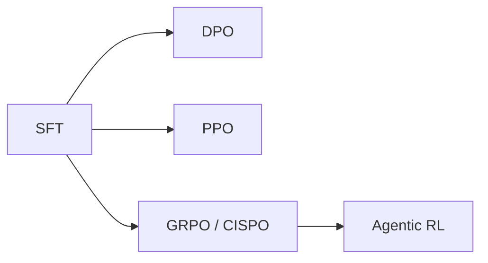

# 第 7 课：把 RL 当成进阶阅读地图

这节课不要求你推公式，也不要求你第一周就把 RL 训练跑通。

目标只有一个：建立地图。也就是知道每个脚本为什么存在、比 SFT 多了什么反馈信号、你以后该从哪里继续深入。

## 先给自己一个正确预期

第一次读 RL 相关代码时，最容易出现的误区是：

- 一上来就死磕公式
- 一上来就想完整跑训练
- 一上来就想同时理解 DPO、PPO、GRPO、Agentic RL

更稳的方式是：

1. 先问“这个脚本想解决什么问题”
2. 再问“它比 SFT 多了什么信号”
3. 最后才问“loss 具体长什么样”

## 这节课先看哪些文件

- `trainer/train_dpo.py`
- `trainer/train_ppo.py`
- `trainer/train_grpo.py`
- `trainer/train_agent.py`
- `trainer/rollout_engine.py`
- `dataset/lm_dataset.py`
- `README.md` 中 DPO、PPO、GRPO、Agentic RL 相关章节

## 先记住这张关系图

可以先把它理解成：

- SFT 是起点
- DPO 用偏好对来继续优化
- PPO / GRPO 用 rollout 和奖励继续优化
- Agentic RL 是把这种奖励学习扩展到多轮工具使用场景

## 先用一张表建立最小地图

| 方法 | 主要脚本 | 训练信号来自哪里 | 你第一遍应该关注什么 |
| --- | --- | --- | --- |
| SFT | `trainer/train_full_sft.py` | 标准答案文本 | 模板、labels、回答区间 |
| DPO | `trainer/train_dpo.py` | chosen vs rejected 偏好对 | 两个回答如何被比较 |
| PPO | `trainer/train_ppo.py` | rollout 后的 reward | 采样、奖励、策略更新 |
| GRPO | `trainer/train_grpo.py` | 分组 rollout 奖励 | 分组奖励、优势、KL |
| Agentic RL | `trainer/train_agent.py` | 多轮工具使用反馈 | 工具调用合法性、任务完成度 |

## 逐个脚本应该怎么看

### 1. `train_dpo.py`

第一遍只问三个问题：

1. 输入数据长什么样？
2. chosen 和 rejected 分别怎么编码？
3. loss 是怎么把“偏好更好”这件事写进去的？

你可以先记住一句话：

- DPO 的训练信号不是标准答案，而是“这个回答比那个回答更好”

阅读时重点看：

- 数据读取
- chosen / rejected prompt 构造
- loss 计算

### 2. `train_ppo.py`

第一次读 PPO 相关脚本时，别先盯着公式。先看这条主线：

1. 先给一个 prompt
2. 模型自己 rollout 生成回答
3. 根据回答得到 reward
4. 再用 reward 回来更新策略

你要先抓住它和 SFT 最大的不同：

- SFT 的答案是提前写好的
- PPO 的一部分训练数据是在训练过程中现采样出来的

### 3. `train_grpo.py`

这一份更适合当作第一周的 RL 阅读主文件，因为它把“奖励学习”写得更集中。

第一次看时，建议只盯这些点：

- `RLAIFDataset`
- rollout 得到多个回答
- `calculate_rewards(...)`
- grouped rewards
- advantages
- policy loss
- KL 约束

你可以先把 GRPO 理解成：

- 同一个问题生成多份回答
- 在组内比较它们的相对好坏
- 再据此更新策略

这份脚本里特别值得新手注意的是：

- 奖励不只是“答对没答对”
- 还可能来自长度、格式、重复惩罚、reward model 等多个信号

### 4. `train_agent.py`

这一份不适合第一周深入实现，但非常适合第一周建立认知边界。

你只要先看懂：

- 它不再只是单轮回答优化
- 它开始关心多轮 tool use 场景
- 奖励会和工具调用是否合法、是否命中目标、是否按格式闭环有关

先记一句话就够：

- Agentic RL 是把“基于反馈优化策略”的思路推进到多轮工具使用任务

## 推荐的阅读顺序

如果你只打算第一周读一遍 RL 地图，推荐这个顺序：

1. `README.md` 里 DPO / PPO / GRPO 的解释
2. `dataset/lm_dataset.py` 里 `DPODataset` 和 `RLAIFDataset`
3. `trainer/train_grpo.py`
4. `trainer/train_dpo.py`
5. `trainer/train_agent.py`

这样安排的原因是：

- 先看 README，先知道“为什么有这些方法”
- 再看 dataset，知道“训练信号以什么数据结构进来”
- 再看训练脚本，知道“这些信号是怎么进 loss 的”

## 你第一遍不用深挖的点

下面这些点都是真问题，但不适合在第一周强行搞透：

- PPO 的完整推导
- DPO 和 PPO 的严格数学关系
- GRPO 的所有变体对比
- CISPO 的 clip 梯度细节
- rollout engine 的并行和性能优化
- reward model 的训练过程

第一周先做到：

- 能说清楚“每一类方法为什么存在”
- 能指出“它们各自的训练信号来自哪里”

## 用一句话分别解释这些方法

你可以把这段当作口头复述模板。

### SFT

- 用人工或合成的标准答案继续做监督学习，让模型学会按助手格式完成任务

### DPO

- 用偏好对训练模型，让模型更偏向 chosen、少偏向 rejected

### PPO

- 让模型先自己生成，再根据奖励信号回过头来更新策略

### GRPO

- 让同一个问题生成多份回答，在组内比较相对好坏，再据此优化策略

### Agentic RL

- 把策略优化推进到多轮工具使用场景，让模型根据环境反馈学会更完整的任务执行

## 这节课读完后必须能回答的问题

1. DPO 和 SFT 的训练信号最大区别是什么？
2. 为什么 PPO / GRPO 要引入 rollout？
3. GRPO 比单个回答打分多了什么视角？
4. Agentic RL 为什么天然更适合放在最后学？
5. 为什么第一周先建立 RL 地图，比死磕公式更重要？

## 你当天应该留下的学习产物

建议你自己做一张对比表，至少包含下面 4 列：

- 方法名
- 数据从哪里来
- 奖励或监督信号是什么
- 训练时模型比 SFT 多做了什么

如果你能把这张表完整写出来，第一周的 RL 目标就已经达成了。
